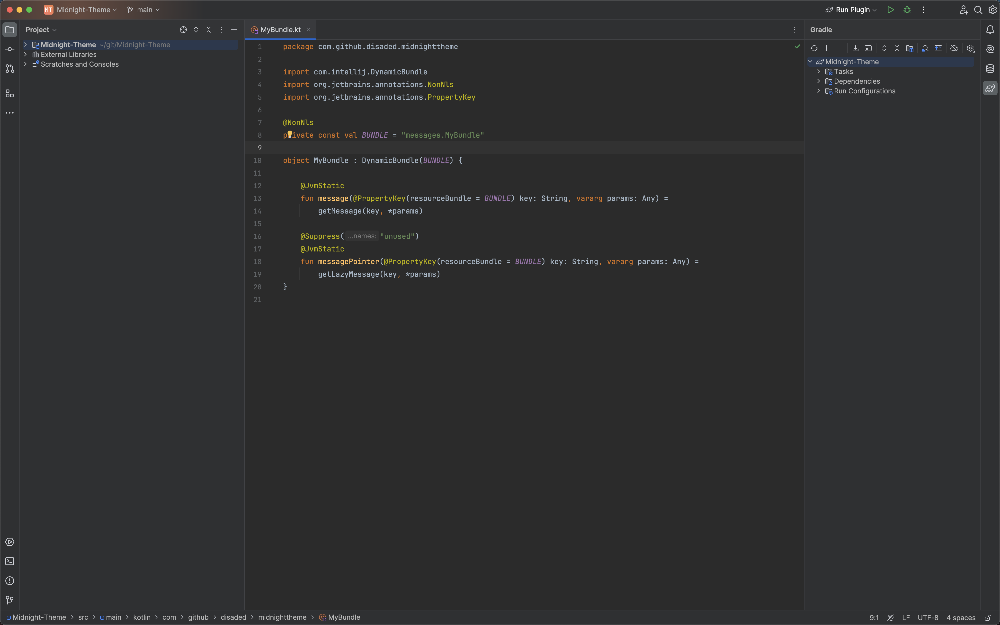

# Midnight-Theme

<!-- Plugin description -->

<!-- Plugin description end -->

## Description
Midnight Theme is a sleek, modern programming theme designed for developers who love working into the late hours.
Its dark color palette, with a subtle hint of gray silver,
creates a serene and focused coding environment, perfect for night-time coding sessions.
  
For JetBrains IDEs, version 2023.2 and above.

## Installation

- Using the IDE built-in plugin system:
  
  <kbd>Settings/Preferences</kbd> > <kbd>Plugins</kbd> > <kbd>Marketplace</kbd> > <kbd>Search for "Midnight-Theme"</kbd> >
  <kbd>Install</kbd>
  
- Manually:

  Download the [latest release](https://github.com/disaded/Midnight-Theme/releases/latest) and install it manually using
  <kbd>Settings/Preferences</kbd> > <kbd>Plugins</kbd> > <kbd>⚙️</kbd> > <kbd>Install plugin from disk...</kbd>

---
Plugin based on the [IntelliJ Platform Plugin Template][template].

[template]: https://github.com/JetBrains/intellij-platform-plugin-template
[docs:plugin-description]: https://plugins.jetbrains.com/docs/intellij/plugin-user-experience.html#plugin-description-and-presentation
